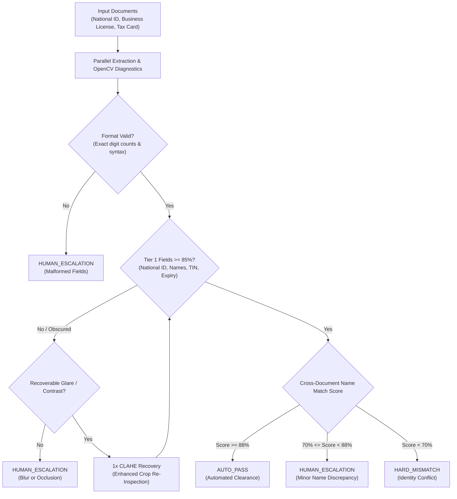
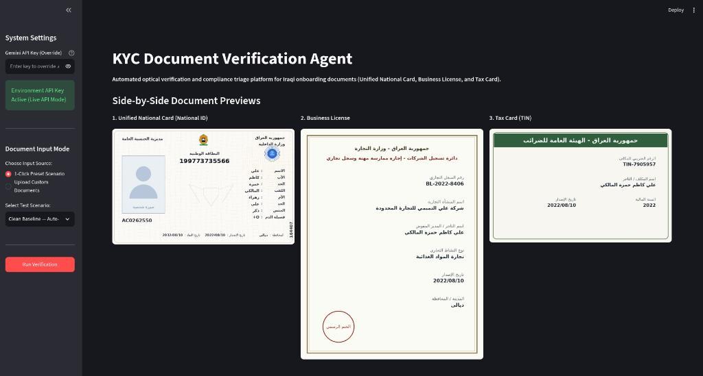
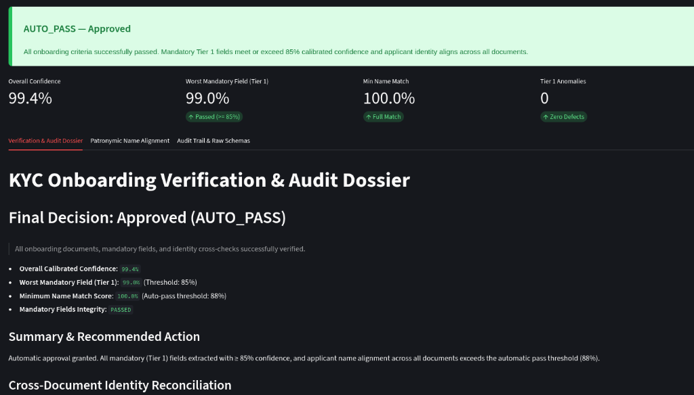
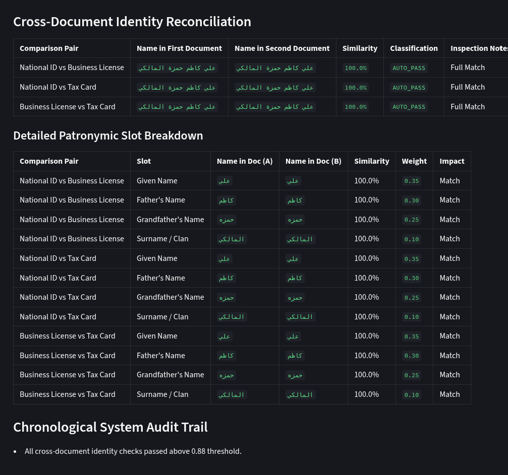

# Autonomous KYC Document Verification Agent

Autonomous multimodal verification and deterministic triaging pipeline for merchant and customer onboarding documents.

---

## Overview

The **Autonomous KYC Document Verification Agent** automates the verification of official onboarding document packages, replacing manual processing with physically grounded, zero-hallucination extraction and deterministic identity reconciliation.

The system processes three official documents:
1. **Unified National Card**: Front-face personal identity document verifying the 12-digit National ID number, bearer full name, family details, and expiration date.
2. **Business License**: Municipal commercial registry document establishing entity registration, license number, and merchant owner name.
3. **Tax Card**: General Commission for Taxes identification certifying Tax Identification Number (TIN) and taxpayer name.

Applications are deterministically triaged into three clear lifecycle outcomes:
* **`AUTO_PASS`**: Automated clearance when all critical fields achieve calibrated confidence $\ge 0.85$ and cross-document identity similarity achieves $\ge 0.88$.
* **`HUMAN_ESCALATION`**: Routed to an operations officer with an auditable exception dossier when critical fields fall below threshold, fields are obscured, or minor name discrepancies occur.
* **`HARD_MISMATCH`**: Immediate flag when cross-document identity similarity falls below $0.70$, indicating irreconcilable legal identities.

---

## System Architecture



---

## Visual Verification Dashboard

The interactive verification dashboard provides an end-to-end interface for document ingestion, optical diagnostics, and audit trail inspection.

### 1. Document Intake & Side-by-Side Previews
Front-face previews of the Unified National Card, Business License, and Tax Card with dual input modes (1-click presets or custom upload):



### 2. Live Decision Banner & Triage Metrics
Prominent outcome banners (`AUTO_PASS`, `HUMAN_ESCALATION`, `HARD_MISMATCH`) with live KPI metrics:



### 3. Cross-Document Identity Reconciliation & Patronymic Breakdown
Slot-by-slot patronymic chain breakdown (Given, Father, Grandfather, Surname), match weights, and chronological audit trail:



---

## Core Pipeline Components

### 1. Isolated Document-Parallel Multimodal Extraction
* **Isolated Extraction Contexts**: Each document is parsed in an independent API call with document-specific system prompts to prevent cross-document hallucination.
* **Strict Pydantic Schemas**: Structured JSON output enforced via Pydantic models ([`NationalIDSchema`](src/models/schemas.py), [`BusinessLicenseSchema`](src/models/schemas.py), [`TaxCardSchema`](src/models/schemas.py)).
* **Zero-Hallucination Invariant**: Enforced by [`ExtractedField`](src/models/schemas.py): any field marked as obscured must have a `null` value, and any `null` value must be marked as obscured.

### 2. Physical Quality Diagnostics & Confidence Calibration
* **Grounding in Physical Optics**:
  * **Laplacian Variance**: Measures edge focus sharpness ($\sigma^2_{\Delta}$). Low variance flags optical motion or defocus blur.
  * **Specular Glare Ratio**: Quantifies bright, desaturated saturated regions in HSV color space ($V \ge 253, S \le 35$).
* **Deterministic Format Validation**: Validates exact digit counts (12 numeric digits for National ID) and standard commercial registration formats.
* **Composite Calibrated Confidence**:
  $$\text{Calibrated Confidence} = \text{Model Signal} \times \text{Local Clarity Factor} \times \text{Format Valid (1 or 0)}$$
* **Bounded 1x CLAHE Recovery**: When a critical Tier 1 field fails ($\text{confidence} < 0.85$) due to recoverable contrast or glare defects, the system crops the region with 15% margin, applies Contrast-Limited Adaptive Histogram Equalization on the LAB luminance channel, and executes a single targeted re-inspection.

### 3. Onomastic & Patronymic Identity Reconciliation
* **6-Stage Orthographic Normalization**:
  1. Diacritics and elongation stripping.
  2. Glottal stop (Hamza) standardization across orthographic variants.
  3. Alif Maqsura and Persian Yeh unification to standard Arabic Yaa.
  4. Taa Marbuta unification to Haa.
  5. Elongated definite article prefix normalization.
  6. Compound name spacing closure (e.g. Abd- and Din- prefixed or suffixed name compounds).
* **Teknonym (Kunya) Handling with Lexicon Protection**: Recognizes informal teknonyms (e.g. Abu, Umm prefixes) to correctly shift patronymic slots, while strictly protecting real Alif-Meem given names from misclassification.
* **Definite Article De-Biasing**: Removes the tribal prefix ("Al-") before computing token similarity to prevent false score inflation on tribal roots.
* **Semantic 4-Part Alignment**: Weighted token comparison prioritizing Given Name ($0.35$), Father's Name ($0.30$), Grandfather's Name ($0.25$), and Tribal Surname ($0.10$).
* **Deterministic Policy Caps**: Conflicting tribal surnames cap similarity at $0.82$; missing patronymic tokens or informal teknonyms cap similarity at $0.85$, preventing unverified automated approvals.

### 4. Deterministic Triage Gating
* **Tier 1 Critical Fields** ($\ge 0.85$ confidence required): National ID Number, Full Name, Expiry Date, License Number, Business Name, Tax ID, Taxpayer Name.
* **Tier 2 Contextual Fields** ($\ge 0.70$ confidence required): Mother's Name, Issue Date, Province, Business Activity, Fiscal Year. Sub-threshold values generate audit warnings without halting auto-pass.
* **Bipartite Fallback**: If the National ID full name is obscured or unreadable, the system gracefully degrades to direct Business License vs. Tax Card comparison.

### 5. Auditable Exception Dossier
* Generates a complete Markdown audit report for operations personnel.
* Displays side-by-side document previews with color-coded bounding boxes (red for failing Tier 1 fields, amber for Tier 2 warnings).
* Provides a slot-by-slot patronymic diff table detailing tokens, similarity scores, weights, and relative impact.

---

## Repository Structure

```text
.
├── app.py                      # Root launcher for Streamlit dashboard
├── requirements.txt            # Python dependencies
├── CONTEXT.md                  # Domain definitions and ubiquitous language
├── docs/
│   └── images/                 # Web verification dashboard screenshots
├── src/
│   ├── ui/
│   │   └── app.py              # Streamlit web verification dashboard
│   ├── triage/
│   │   └── triage_engine.py    # Deterministic triage orchestrator and dossier generator
│   ├── extraction/
│   │   └── gemini_extractor.py # Multimodal extraction, logprobs, and CLAHE retry
│   ├── vision/
│   │   └── diagnostics.py      # OpenCV blur, glare, and confidence calibration
│   ├── matching/
│   │   └── arabic_matcher.py   # 6-stage normalizer and patronymic chain matcher
│   ├── models/
│   │   └── schemas.py          # Pydantic schemas and zero-hallucination validation
│   ├── benchmark/
│   │   └── benchmark_suite.py  # Empirical evaluation suite and offline simulator
│   └── data/
│       └── synthetic_generator.py # Synthetic document renderer with defect injection
├── tests/                      # Pytest test suite (112 test cases)
└── demo_samples/               # Pre-generated sample document packages
```

---

## Getting Started

### Prerequisites
* Python 3.11+ (Python 3.13 tested and supported)
* Virtual environment tool (`venv`)

### Installation

1. Clone the repository:
   ```bash
   git clone <repository-url>
   cd KYC-Documentation-agent
   ```

2. Create and activate a virtual environment:
   ```bash
   python3 -m venv .venv
   source .venv/bin/activate
   ```

3. Install required dependencies:
   ```bash
   pip install -r requirements.txt
   ```

4. Configure environment variables (optional for live Gemini calls):
   Create a `.env` file in the root directory:
   ```env
   GEMINI_API_KEY=your_gemini_api_key_here
   ```

---

## Usage

### 1. Launching the Verification Dashboard
Run the Streamlit web dashboard:
```bash
streamlit run app.py
```
Open your browser at `http://localhost:8501`.

The dashboard supports two input workflows:
* **1-Click Preset Scenarios**: Pre-configured test scenarios covering clean auto-pass, specular glare, Gaussian blur, camera tilt, and planted identity mismatch cases.
* **Custom Document Upload**: Upload custom front-face photographs of the Unified National Card, Business License, and Tax Card.

### 2. Running Test Suite
Execute the full test suite (112 test cases covering extraction, normalization, diagnostics, triage, and UI components):
```bash
pytest
```

---

## Technical Policies & Safety Guarantees

* **Fail-Closed Default**: Any unexpected system exception during extraction or matching immediately falls back to `HUMAN_ESCALATION` with diagnostic details preserved in the audit log.
* **Zero Secret Echoing**: API keys entered via the dashboard UI are never displayed in the DOM or written to log files.
* **Deterministic Scoring**: All normalization, Jaro-Winkler calculations, and threshold evaluations run in pure Python without non-deterministic LLM evaluation loops.
